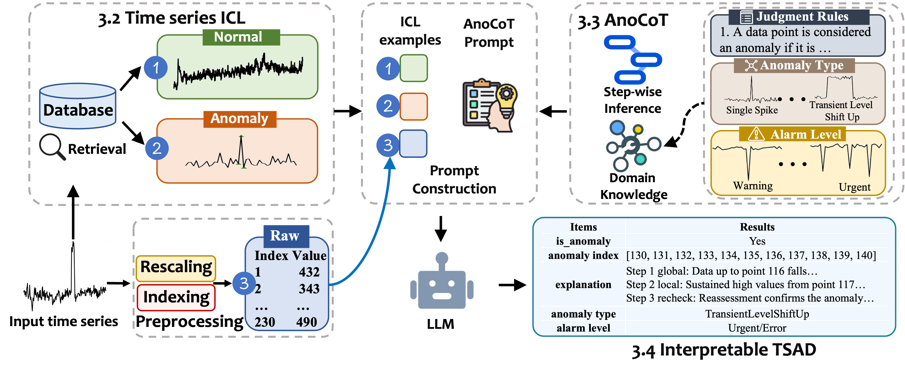

# LLMAD: Large Language Models can Deliver Accurate and Interpretable Time Series Anomaly Detection.

## Description
This repository contains the code for the paper: ["Large Language Models can Deliver Accurate and Interpretable Time Series Anomaly Detection"](https://arxiv.org/abs/2405.15370). It demonstrates the use of Large Language Models (LLMs) to tackle the task of Time Series Anomaly Detection.



## Table of Contents

- [Installation](#installation)
- [Usage](#usage)
  - [Configuration](#configuration)
  - [Running the Scripts](#running-the-scripts)
    - [Yahoo Dataset](#yahoo-dataset)
    - [WSD Dataset](#wsd-dataset)
    - [KPI Dataset](#kpi-dataset)
- [File Descriptions](#file-descriptions)


## Installation

To get started, clone the repository and install the necessary dependencies:

```shell
cd LLM_AD
pip install -U openai fastdtw pandas numpy scipy
```

## Usage

### Configuration

Before running the scripts, set up your configuration file `config.yaml` with your OpenAI API details:

```yaml
openai:
  api_key: "your-api-key"
  base_url: "https://api.openai.com/v1"
```

### Running the Scripts

Below are the commands to run the scripts for different datasets.

#### Yahoo Dataset

```shell
bash script/yahoo.sh
```

#### WSD Dataset

```shell
bash script/wsd.sh
```

#### KPI Dataset

```shell
bash script/kpi.sh
```

## File Descriptions

| File Name            | Description                        |
|----------------------|------------------------------------|
| `run.py`             | Program entry point                |
| `Prompt_template.py` | Structure of the prompt            |
| `Eval/*`             | Scripts to compute evaluation metrics|

If you find this repo helpful, please cite the following papers:
```
@article{liu2024large,
  title={Large Language Models can Deliver Accurate and Interpretable Time Series Anomaly Detection},
  author={Liu, Jun and Zhang, Chaoyun and Qian, Jiaxu and Ma, Minghua and Qin, Si and Bansal, Chetan and Lin, Qingwei and Rajmohan, Saravan and Zhang, Dongmei},
  journal={arXiv preprint arXiv:2405.15370},
  year={2024}
}
```